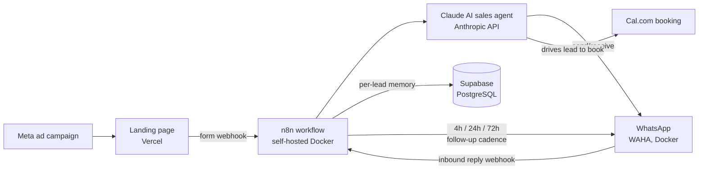

# One Life Fitness — AI Lead Automation System

A full-stack lead generation and automated follow-up system built for a personal training business in Utrecht, Netherlands.

## What it does

When a prospect submits the landing page form, the system:

1. Catches the webhook in **n8n** (self-hosted)
2. Fires an AI sales agent (powered by **Anthropic Claude API**) that sends a personalised first message via **WhatsApp**
3. Continues the conversation automatically — qualifying the lead, handling objections, and driving them toward booking a free consultation
4. Follows up automatically at 4h → 24h → 72h if there's no reply (3-strike logic, then stops)

The AI agent speaks Dutch by default and switches to English if the lead replies in English. It's built to match the trainer's exact tone and sales style.

## Results (first 6 weeks in production)

- **32% automated lead-to-booking conversion**
- Runs 24/7 unattended; leads converse naturally without realising it's automated
- Detailed funnel data available on request (client data stays private)

## Architecture



## Tech stack

| Layer | Tool |
|---|---|
| Automation | n8n (self-hosted, Docker) |
| AI agent | Anthropic Claude API |
| WhatsApp | WAHA (self-hosted Docker) |
| Database | Supabase (PostgreSQL) |
| Landing page | HTML/CSS/JS → Vercel |
| Booking | Cal.com |

## Repository structure

```
LP/                          # Landing page (HTML/CSS/JS) deployed on Vercel
ASSETS/                      # Brand assets, trainer photos, logo
create_leads_table.sql       # Supabase schema with RLS and auto-updated_at trigger
docker-compose.example.yml   # Sanitized self-hosted stack (n8n + WAHA)
workflow/OVERVIEW.md         # Node-level workflow architecture (see note below)
```

> **Why no workflow export?** The n8n workflow is the commercial core of this
> system and is deployed for clients as a paid product, so the importable JSON
> is intentionally not published. `workflow/OVERVIEW.md` documents the node-level
> design instead.

## Key technical decisions

- **Single n8n workflow, two triggers** — form webhook (outbound) and WAHA trigger (inbound reply) both handled in one workflow, confirmed working despite docs suggesting otherwise
- **Docker-to-Docker networking** — WAHA webhook uses `host.docker.internal` to reach n8n
- **WhatsApp memory keying** — form submissions use phone number; WAHA replies use `@lid` format. Solution: WAHA `check-exists` API converts phone → @lid on first contact so memory session stays consistent
- **Bilingual agent** — Dutch default, auto-switches on English reply, never mixes languages mid-conversation
- **Debounce** — Wait node (3s) handles rapid-fire messages; Redis-based dedup planned for production

## Business model

Performance deal: 10% recurring commission per converted client. Client covers ad spend (~€400/month). Infrastructure cost: ~€15/month.

Built as a reusable template — same system can be deployed for other fitness/coaching businesses.
